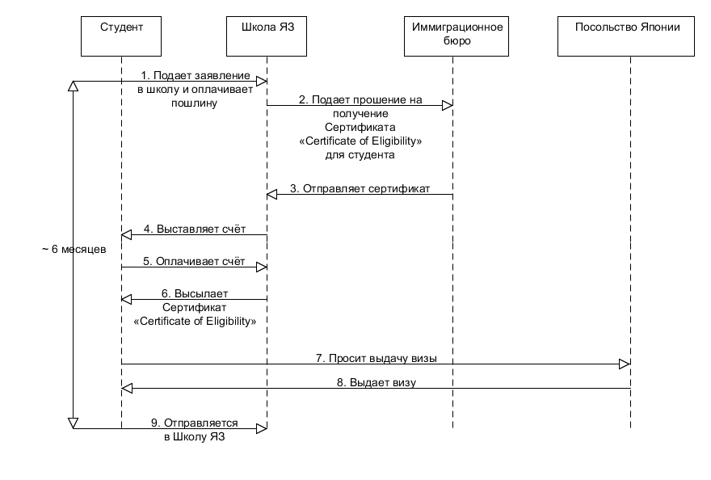

## Введение
Данный документ предназначен для тех кто собирается поступать в **японскую языковую школу**.
Это попытка собрать наиболее полную и непротиворечивую информацию,
необходимую для поступления и **обучения японскому языку в Японии**,
основанную на **достоверных** источниках.

**Информация** данная здесь, будет, по возможности, **подкреплятся источниками**.

## Дисклеймер
Вся информация была получена из открытых источников. Автор документа не был студентом долгосрочных курсов.
Используйте на свой страх и риск.

## Долгосрочные и краткосрочные курсы
Обучение делится на:
- **Краткосрочные курсы** 1-3 месяца 
- **Долгосрочные курсы** от 6 месяцев до 2 лет

Краткосрочные курсы, по сути, приравниваются к туризму, и здесь рассматриваться не будут.

## Глоссарий

- Школа япоского языка (日本語教育機関), далее **Школа ЯЗ** - школа японского языка, находящаяся в Японии.

- **Студент** (生徒 или 入学者) Вы, желающий поступить, находящийся за пределами Японии.

- **Иммиграционное бюро** (入国管理局) http://www.immi-moj.go.jp/index.html

- **Посольство Японии** - посольство Японии, находящееся в стране проживания студента.

- **Министерство юстиции Японии** (法務省) http://www.moj.go.jp/

- **Министерство образования, культуры, спорта, науки и технологий** (文部科学省) http://www.mext.go.jp/

- **Certificate of Eligibility** (在留資格認定証明書) - сертификат, подтверждающий статус пребывания в Японии.

- **Ист.** - источник
- **(т.у.и)** - Сокращение "требуется уточнить источник".
Помечается информация к которой не найдено достоверного источника. 

## Основные требования к студентам

- **минимум 12 лет образования** (т.у.и).
Это связано с тем, что Школы ЯЗ являются школами *дополнительного* образования и не могут заменять начальную школу.

**Иммиграционное бюро** не предъявляет каких-то конкретных требований к студентам. 
Ему передается информация о студенте и на основании этого принимается решение *(т.у.и)*.

**Школа ЯЗ**, помимо требований законодательства (см. далее),
вправе предоставлять к студентам собственные требования (например, возрастные ограничения).

## Процесс поступления

Процесс поступления начинается **за 6 месяцев** до начала обучения, и
в общем виде выглядит следующим образом.
[Ист.](https://www.isi-education.com/ja/application/process/student-visa/)
Описан идеальный сценарий.

1. Студент ищет школу готовую её/его принять.
Заполняет всякие анкеты и оплачивает пошлину за рассмотрение.
Размер пошлины зависит от школы, примерно 20 000-30 000円
([Yula](https://yula.jp/tuition/), [ISI](https://www.isi-education.com/ja/application/fee/))

2. Школа ЯЗ просит Иммиграционное бюро выдать для вас Сертификат
**"Certificate of Eligibility"**. (在留資格認定証明書交付申請)\
[Подробнее о процедуре](http://www.moj.go.jp/ONLINE/IMMIGRATION/16-1.html) \
[Еще о процедуре](http://www.moj.go.jp/ONLINE/IMMIGRATION/ZAIRYU_NINTEI/zairyu_nintei10_17.html) \
[Анкета прошения](http://www.moj.go.jp/content/001268753.pdf)

3. Результат прошения отправляют школе. В случае одобрения, школа получает Ваш Сертификат.
4. Школа выставляет вам счёт за обучение.
5. Вы оплачивает счёт.
6. После подтверждения получения оплаты, школы выслает вам Сертификат **"Certificate of Eligibility"**
7. Вы, на основании Сертификата и других документов, просите Японское посольтво выдать Вам визу.
8. Если визу одобряют, Вы её получаете.
Можете лететь в Японию.

## Основные требования к Школам ЯЗ (со стороны японского законодательства)

##### Школа ЯЗ, при подборе студентов, должна убедиться:
 - 学習能力 - в способности студента обучаться
 - 勉学意欲 - в желании студента обучаться
 - 経費支弁能力 - в возможности оплатить расходы

Ист. [日本語教育機関の運営に関する基準](http://www.moj.go.jp/content/000073836.pdf)
> ７の２  日本語教育機関は、入学者の選考に関し、学習能力、勉学意欲、経費支弁能力等について適切な
>  方法により確認するものとする。

Каким образом Школа ЯЗ должна это проверить законодательство не указывает. Однако, от школы требуется предоставить
того описание каким образом она осуществляет проверку. (т.у.и)

##### Школа ЯЗ должна проводить занятий на не мене чем 760 часов в год, и не менее 20 часов в неделю.
Ист. [日本語教育機関の運営に関する基準](http://www.moj.go.jp/content/000073836.pdf)
> ４  日本語教育機関の授業時数は、１年間にわたり７６０時間以上で、かつ、１週間当たり２０時間
>   以上とするものとする。 

Другие требования см. в этом же документе [日本語教育機関の運営に関する基準](http://www.moj.go.jp/content/000073836.pdf)

## Сроки рассмотрения документов

#### Certificate of Eligibility - 1-3 месяца 
[[Ист.]](http://www.moj.go.jp/ONLINE/IMMIGRATION/16-1.html)
> 標準処理期間 	１か月～３か月

[Среднее время рассмотрения](http://www.moj.go.jp/nyuukokukanri/kouhou/nyuukokukanri07_00140.html)

#### Виза - 4 дня 
[[Ист.]](https://www.ru.emb-japan.go.jp/VISANDTOURISM/Visa/Info.html)
> При отсутствии замечаний к заявлению виза выдается на 4-ый рабочий день после представления всех необходимых документов.

## Полезные ссылки

[База данных Школ ЯЗ](https://www.nisshinkyo.org/search/) Есть статистика по студентам и ценам. Замечено что в базе есть не все школы.

[Гайдлайн для Школ ЯЗ](https://www.nisshinkyo.org/article/pdf/guide1.pdf) Из интересного - когда и в каком количестве возвращать деньги в случае отчисления.